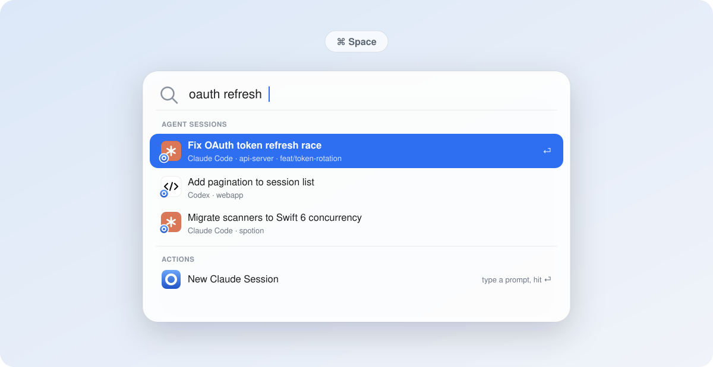
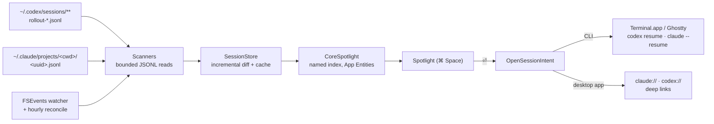

<div align="center">
  
  <h1>Spotion</h1>
  <p><strong>Your Codex &amp; Claude Code sessions, right inside macOS Spotlight.</strong></p>
  <p>
    
    
    <a href="LICENSE"></a>
    <a href="https://github.com/Iris-Ares/Spotion/issues"></a>
  </p>
</div>

<picture>
  <source media="(prefers-color-scheme: dark)" srcset="docs/hero-dark.svg">
  
</picture>

<p align="center"><sub><em>Stylized illustration of the workflow — your sessions appear in the real macOS Spotlight.</em></sub></p>

You run [Codex CLI](https://developers.openai.com/codex/cli) and [Claude Code](https://code.claude.com) sessions all day, then lose them: which terminal tab had the auth refactor? What was that session called? Spotion indexes every session into **native Spotlight**, so finding one is just <kbd>⌘</kbd><kbd>Space</kbd>, a few keystrokes, and <kbd>⏎</kbd> — the session resumes in your terminal, in the right working directory. No Raycast, no Alfred, no launcher replacement: the entry point is 100% stock macOS.

## Features

- **Search every session** — by title, first prompt, project name, working directory, or git branch. Codex and Claude Code branch metadata is indexed when the local session provides it. An off-by-default privacy setting can also index recent project-relative file paths from recognized structured Read/Write/Edit tool inputs. Codex titles come from its own session index; Claude Code titles follow the same priority the CLI uses (custom title → AI title → last prompt → first message).
- **Resume with one keystroke** — <kbd>⏎</kbd> opens the session as `codex resume` / `claude --resume` in Terminal.app or [Ghostty](https://ghostty.org), after `cd`-ing to the session's original directory.
- **Or hand off to the desktop app** — per agent, choose to open sessions in the Claude or ChatGPT (Codex) desktop apps instead, via `claude://` / `codex://` deep links.
- **Quick Create from Spotlight** — run *New Codex Session* / *New Claude Session* actions right inside Spotlight (macOS 26 Spotlight Actions): type a prompt inline, optionally pick a recent project, hit <kbd>⏎</kbd>, and the session starts in your terminal.
- **Always fresh** — a lightweight menu-bar app watches `~/.codex` and `~/.claude` for changes and keeps the index in sync, with an hourly reconcile as a safety net.
- **Fast and careful** — incremental diffs, bounded file reads (large transcripts are never read whole), a named CoreSpotlight index, and durable retry for every index mutation. Native Swift 6, no Electron, no background daemons beyond the menu-bar app itself.

## Install

### Homebrew

```bash
brew install --cask Iris-Ares/tap/spotion
```

That taps [Iris-Ares/homebrew-tap](https://github.com/Iris-Ares/homebrew-tap), trusts the
cask and installs to `/Applications` in one step. Keep the name fully qualified for the
first install — Homebrew refuses to resolve a bare `spotion` from a tap it hasn't been
told to trust. Afterwards the short name works everywhere (`brew upgrade spotion`,
`brew uninstall --cask spotion`).

Already running a copy from a manual download or `make install`? Add `--adopt` and
Homebrew takes over the existing `/Applications/Spotion.app` instead of refusing.

### Manual

1. Download `Spotion-X.Y.Z.zip` from the [latest release](https://github.com/Iris-Ares/Spotion/releases/latest), unzip it.
2. **Drag `Spotion.app` into `/Applications` before the first launch.** (Launching from the
   Downloads folder triggers App Translocation, which also breaks in-app updating.
   Homebrew avoids this by installing straight to `/Applications`.)
3. Cautious? Each release ships a `SHA256SUMS.txt` — verify with
   `shasum -a 256 -c SHA256SUMS.txt` next to the downloaded ZIP.

### Then: let it through Gatekeeper

Either way, the **first** launch is blocked — builds are not yet Developer-ID signed or
notarized (no paid Apple Developer membership), and Homebrew always quarantines cask
downloads. Open **System Settings → Privacy & Security**, scroll to the *"Spotion.app" was
blocked* notice, click **Open Anyway** and confirm. On macOS 26 the old right-click → Open
shortcut no longer bypasses this. Terminal alternative:

```bash
xattr -d com.apple.quarantine /Applications/Spotion.app
```

This friction is **first install only**: in-app updates installed by Sparkle are not
quarantined and won't re-trigger Gatekeeper. One known limitation of ad-hoc signing: macOS
may re-ask for the Terminal automation permission after an update, because it can't link
the new build to the previous grant.

## Updates

Spotion checks GitHub Releases for updates once a day (toggle in Settings → General →
软件更新) without interrupting you — a new version shows up as a row in the menu-bar
dropdown with a one-click install (download / verify / relaunch handled by
[Sparkle](https://sparkle-project.org), updates EdDSA-signed). Manual check: menu bar →
*Check for Updates…*. Release process and rollback: [docs/RELEASING.md](docs/RELEASING.md).

Homebrew installs stay out of Sparkle's way — the cask is marked `auto_updates true`, so
`brew upgrade` only steps in if the installed app has actually fallen behind.

## Requirements

- **macOS 26 (Tahoe) or later** — Spotion is built on macOS 26's Spotlight Actions and App Intents indexing.
- At least one agent CLI whose sessions you want to index: [Codex CLI](https://developers.openai.com/codex/cli) and/or [Claude Code](https://code.claude.com).
- Optional: [Ghostty](https://ghostty.org) as the launch terminal, and/or the [Claude](https://claude.ai/download) / [ChatGPT](https://chatgpt.com/download) desktop apps as launch targets.

## Build from source

Takes about a minute:

```bash
git clone https://github.com/Iris-Ares/Spotion.git
cd Spotion
make install    # Release build → /Applications/Spotion.app → launch
```

You'll need [Xcode 26+](https://developer.apple.com/xcode/) and [XcodeGen](https://github.com/yonaskolb/XcodeGen) (`brew install xcodegen`). On first launch, Spotion shows a welcome window while it scans and indexes your existing sessions.

To update, pull and reinstall:

```bash
git pull && make install
```

## Usage

1. Press <kbd>⌘</kbd><kbd>Space</kbd> and type part of a session's title, project name, or directory.
2. Select a result and press <kbd>⏎</kbd> — the session resumes in your terminal (or desktop app, if you've chosen that in Settings).
3. To start something new, type "New Codex Session" or "New Claude Session", press <kbd>⇥</kbd>/<kbd>⏎</kbd> to expand the action, enter your prompt, optionally pick a *Project* (recent working directories are suggested), and press <kbd>⏎</kbd>.

The menu-bar icon (a small ring) gives you the five most recent sessions, index statistics, *Rescan Now*, *Rebuild Spotlight Index*, a *Copy Scan Report* debugging helper, and Settings.

> [!TIP]
> The first time Spotion opens a session in Terminal.app, macOS asks for Automation permission (*System Settings → Privacy & Security → Automation*). Approve it once and every later launch is silent.

## How it works



### Session indexing

| | Codex CLI | Claude Code |
|---|---|---|
| **Transcripts** | `~/.codex/sessions/YYYY/MM/DD/rollout-<ts>-<uuid>.jsonl` | `~/.claude/projects/<escaped-cwd>/<uuid>.jsonl` |
| **Titles** | `~/.codex/session_index.jsonl` (`thread_name`) | Title records near the file tail: custom title → AI title → last prompt |
| **Fallbacks** | First user message → project name | First user message → project name |

Reads are strictly bounded: scanners read an expanding head window (up to 4 MB) for metadata and the first real prompt, and a tail window (up to 512 KB) for Claude titles and opt-in metadata — multi-hundred-MB transcripts are never loaded whole. Parsed results are cached in `~/Library/Application Support/Spotion/` and re-parsed only when a file's size or mtime changes. Touched-file paths are transient: Spotion donates at most 20 recent, distinct project-contained paths and their basenames to the local Spotlight index, but never writes them to its scan cache. Shell commands, patches, prose, tool output, reasoning, attachments, and paths outside the session project are excluded.

Sessions are donated to a named CoreSpotlight index as App Entities, so Spotlight gets full semantic results (title, project subtitle, open action) rather than plain file matches. A FSEvents watcher on both agents' data directories triggers incremental refreshes; deletions, agent toggles, and system reindex requests are all reconciled against a persisted index state, with durable retries if the Spotlight service misbehaves.

### Launch modes

Each agent can independently open sessions in the **terminal CLI** (default) or its **desktop app** — *Settings → General → 打开方式 (Open with)*:

- **CLI** — Spotion resolves the agent binary (override → known install paths → Homebrew paths → login-shell `PATH`), then runs `codex resume <id>` or `claude --resume <id>` in your chosen terminal. `claude --resume` only finds sessions from the directory they started in, so Spotion always `cd`s first — this is also why a Claude session whose directory was deleted can't be resumed in CLI mode.
- **Desktop app** — Spotion opens `codex://threads/<uuid>` or `claude://resume?session=<uuid>` with whatever app is registered for the scheme. Codex opens the thread in place. **Claude.app instead *imports* the CLI transcript** into a desktop-managed copy: the sidebar gains a second entry with an app-generated title, and the import rewrites the local transcript file (stripping thinking blocks and title records). Both are Claude.app behaviors outside Spotion's control; Spotion carries the previously indexed title forward so the Spotlight row keeps its name.

Quick Create always launches in the terminal, regardless of launch-mode settings.

## Configuration

All preferences live in *Settings…* (via the menu-bar icon):

| Tab | Options |
|---|---|
| **General** | Enable/disable indexing per agent · per-agent open-with (CLI / desktop app) · terminal choice (Terminal.app / Ghostty) · launch at login |
| **Advanced** | Explicit `codex` / `claude` binary paths (when auto-detection can't find them) · default directory for Quick Create |
| **Index** | Off-by-default later-prompt and touched-file search · session counts, parse failures, last-index time · *Rescan* / *Rebuild Index* · a self-check that queries the index directly and tells you whether a search problem is in Spotion's index or in the Spotlight UI |

## Troubleshooting

**Sessions don't appear in Spotlight.** Run the self-check in *Settings → Index* (it queries CoreSpotlight directly, bypassing the Spotlight UI). The query is not scoped to Spotion's own items, so use a term distinctive to one of your sessions — an unusual word from its title, not something generic like "session". With a distinctive term, hits > 0 mean the donation landed and the problem is on the Spotlight side — check that Spotion is enabled in *System Settings → Spotlight*, or give the system indexer a moment. 0 hits mean the donation never landed — press *Rebuild Index*.

**Enter opens nothing / an error dialog about the binary.** The agent CLI wasn't found in the usual places. Set the explicit path in *Settings → Advanced* (find yours with `command -v codex` / `command -v claude`).

**Terminal.app never opens.** Check *System Settings → Privacy & Security → Automation* → Spotion → Terminal. For Ghostty, the app must be at `/Applications/Ghostty.app`.

**A Claude session won't resume in CLI mode.** `claude --resume` requires the session's original working directory to still exist. If you've deleted it, switch that agent to desktop-app mode — the desktop apps locate transcripts by UUID and don't need the directory.

**Spotlight/App Intents registration seems wedged** (e.g., actions missing after rebuilds). Duplicate app copies in DerivedData confuse LaunchServices — always test against `/Applications/Spotion.app`, and run `make reset-registration` to force re-registration.

## Known limitations

- macOS 26+ only; there are no plans to backport (Spotlight Actions and the indexing APIs Spotion relies on are new in 26).
- Both agents' session-file formats are officially internal and version-unstable. Spotion parses defensively and skips what it can't read, but an agent update could temporarily break indexing until Spotion adapts.
- Opening a session in Claude.app duplicates it into a desktop-managed copy and rewrites the local transcript ([see above](#launch-modes)).
- Sessions whose IDs aren't canonical UUIDs can't be deep-linked to desktop apps.
- Parts of the UI are currently Chinese, parts English — localization is on the wish list, and contributions are welcome.

## Development

```bash
make gen     # generate Spotion.xcodeproj from project.yml (XcodeGen)
make build   # Debug build
make test    # unit tests
make run     # build & launch the Debug app
make install # Release build → /Applications, then launch
make clean   # remove build products and the generated project
```

The `.xcodeproj` is generated and not checked in — edit `project.yml` instead. Build commands pin `DEVELOPER_DIR` to `/Applications/Xcode.app`, so no `xcode-select` switching is needed. Tests are host-less: `SpotionTests` compiles the AppKit-free core (`Models/` + `Scanning/`) directly, avoiding LSUIElement test-host issues.

```
Spotion/
├── Models/      # SessionRecord, settings, cache, agent kinds
├── Scanning/    # Codex/Claude scanners, bounded JSONL reader, SessionStore
├── Spotlight/   # CoreSpotlight indexer, App Entities & queries
├── Intents/     # Open / New Session / Reindex App Intents
├── Launch/      # terminal & desktop-app launchers, binary resolver, shell quoting
├── Watching/    # FSEvents wrapper
└── UI/          # menu bar, settings, first-run window
```

When touching Spotlight behavior, verify against the `/Applications/Spotion.app` copy — see [Troubleshooting](#troubleshooting).

## Contributing

Issues and pull requests are welcome! Please read [CONTRIBUTING.md](CONTRIBUTING.md) for the development workflow and PR expectations, and the [Code of Conduct](CODE_OF_CONDUCT.md). Security issues go through [SECURITY.md](SECURITY.md) instead of the public tracker. Release history lives in [CHANGELOG.md](CHANGELOG.md).

- 🐛 [Report a bug](https://github.com/Iris-Ares/Spotion/issues/new?template=bug_report.yml)
- 💡 [Request a feature](https://github.com/Iris-Ares/Spotion/issues/new?template=feature_request.yml)

## License

Spotion is available under the [MIT license](LICENSE).

Spotion is an independent open-source project. It is not affiliated with, endorsed by, or sponsored by Apple, OpenAI, or Anthropic; Codex, ChatGPT, Claude, and Claude Code are trademarks of their respective owners.
